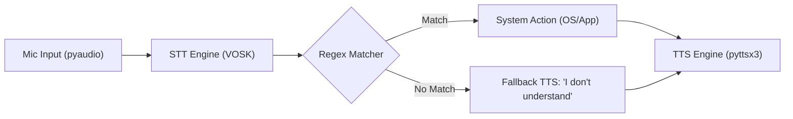
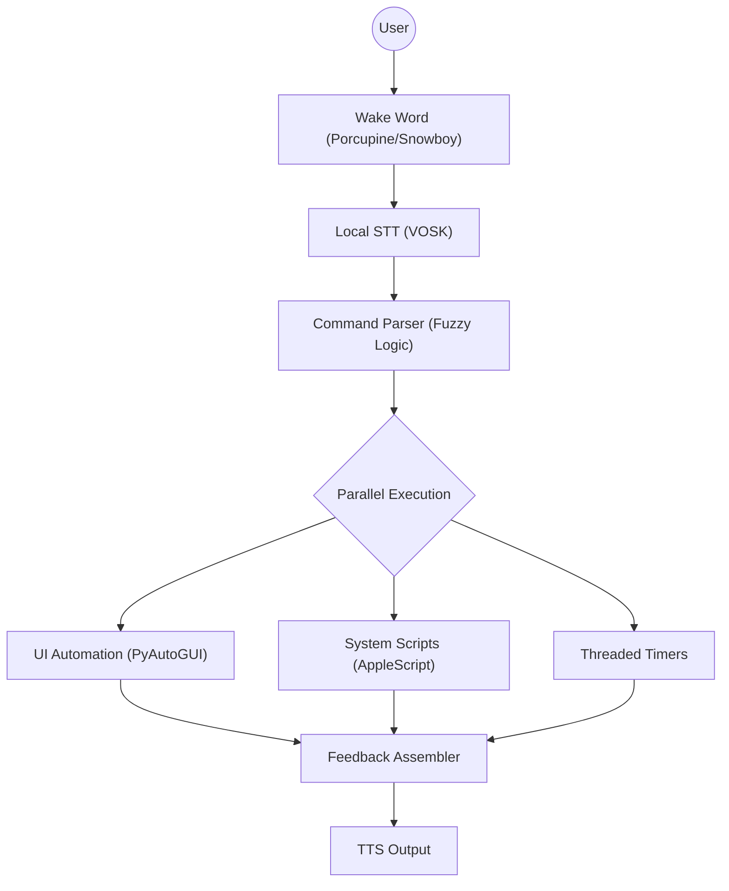
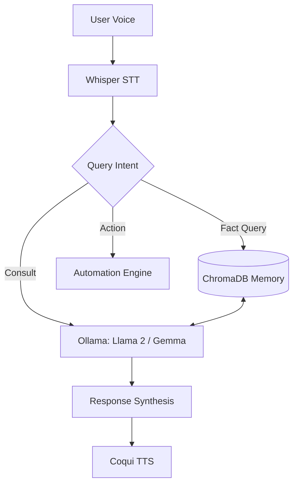
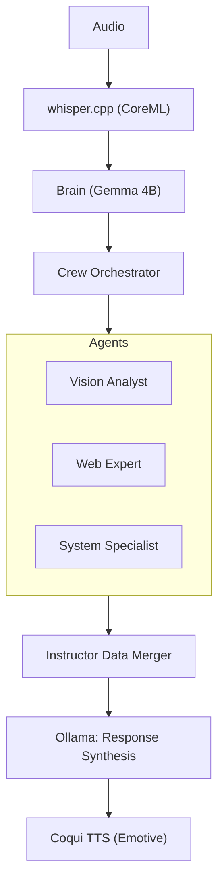
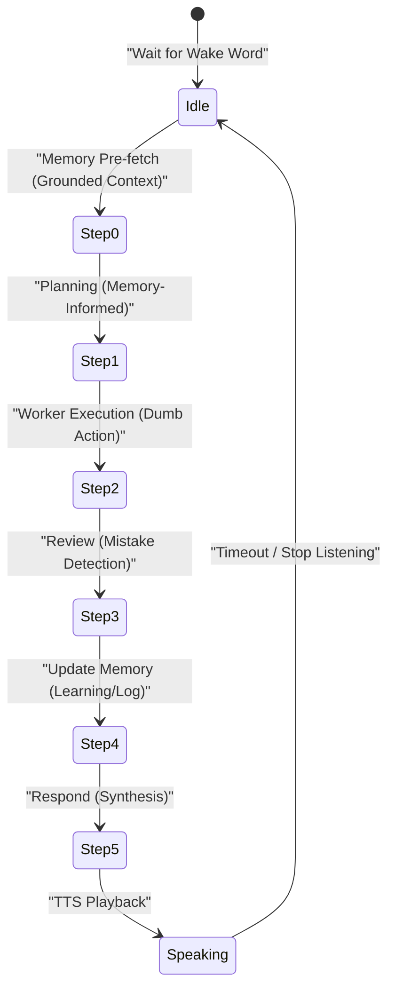

# J.A.R.V.I.S. Legacy & Evolution: The Definitive Technical Archive (v1 - v24.5)

## 🌌 Introduction
This archive is the authoritative technical record of the Just A Rather Very Intelligent System (J.A.R.V.I.S.). It documents the journey from a simple voice-triggered script to a cross-platform AI ecosystem (Web, Desktop, Extension) driven by a self-learning cognitive loop. 

---

## 🏛️ Project Ecosystem & Novelty
JARVIS is not just a voice assistant; it is a multi-interface synchronized suite with several novel highlights:
- **Live AI Coding + Desktop Assistant**: Combined in one system for seamless developer workflows.
- **Screen Understanding**: Real-time modal interpretation using OCR + Computer Vision (YOLO).
- **Safety-First Design**: Confirmation dialogs for destructive actions and strict JSON schema validation.
- **Cross-Platform Integration**:
    - **Desktop App**: macOS/Windows native automation (PyAutoGUI, AppleScript).
    - **Local Backend**: FastAPI + WebSocket hub for low-latency processing.
    - **Web Editor**: React-based code editor with live AI suggestions. [ai-asistant-smoky.vercel.app](https://ai-asistant-smoky.vercel.app)
    - **Chrome Extension**: Inline AI assistance across any web editor with push-to-talk support.

---

## 🏗️ Core System Architecture (The 4 Engines)
The system's heartbeat is composed of four distinct engines working in orchestration:

1.  **Wake Word Engine (OpenWakeWord)**:
    - **Purpose**: Low-power, always-on detection of "Hey Jarvis."
    - **Tech**: Completely local/offline, based on TensorFlow Lite.
2.  **Speech Engine (Whisper/Vosk)**:
    - **Purpose**: Converting user utterances into actionable text.
    - **Tech**: `Vosk` (Offline fast) or `whisper.cpp` (High accuracy).
3.  **AI Brain (Qwen3:1.7b / Gemini)**:
    - **Purpose**: Logic, reasoning, tool selection, and response synthesis.
    - **Tech**: Local Ollama (Qwen) for speed; Gemini 2.5 Flash for high-complexity tasks.
4.  **Action Engine (Automation)**:
    - **Purpose**: Executing physical system changes (Open app, type, click).
    - **Tech**: PyAutoGUI, OS-native scripts, and internal worker threads.

---

## 🔄 The Master "Jarvis Loop" (Execution Flow)
Every interaction follows a strictly defined procedural lifecycle:

| Step | State | Description |
|------|-------|-------------|
| 1 | **Idle** | System listens quietly for the wake word. |
| 2 | **Active** | "Hey Jarvis" detected. UI turns cyan. Mode switches to active listening. |
| 3 | **Hearing** | Speech is transcribed in real-time. Partial results shown for feedback. |
| 4 | **Thinking** | Text sent to the Cognitive Brain for planning and routing. |
| 5 | **Executing** | Worker scripts perform the action (Web search, Vision check, etc.). |
| 6 | **Speaking** | Brain synthesizes a reply; Coqui TTS generates the voice output. |
| 7 | **Cycle** | System stays active for follow-up or returns to idle after timeout. |

---

## 📅 Technical Evolution: Phase by Phase

### **Phase I: The Reactive Foundation (v1 - v10)**
**Concept**: Purely reactive, stateless, regex-based matching.
**Architecture**:

**Problems**: 
- ❌ High latency due to cloud dependencies (Google STT).
- ❌ "Launch Safari" worked, but "Launch the Safari browser" failed regex.
**Removed**: 🛑 Google Cloud STT was removed in favor of local VOSK models for privacy.

---

### **Phase II: The Progressive Automation Era (v11 - v15)**
**Concept**: Expanded environmental control (PyAutoGUI) and threaded tasking.
**Architecture**:

**Problems**: 
- ❌ Echo-feedback loops (hearing its own voice).
- ❌ "Blind" clicks: No verification if buttons actually exist.

---

### **Phase III: The Intelligence Boom (v16 - v20)**
**Concept**: Shift to LLMs, Vector Memory (ChromaDB), and Vision.
**Architecture**:

**Milestones**:
- **v17**: Transition from CSV/JSON to **ChromaDB**.
- **v18**: Screen understanding using **EasyOCR + YOLOv8**.
- **v20**: PDF generation and WhatsApp session hijacking.

---

### **Phase IV: The Agentic Experiment (v21 - v23)**
**Concept**: Multi-Agent Orchestration (CrewAI).
**Architecture**:

**Failure Analysis**: 
- ❌ Latency peaked at 15 seconds per request.
- ❌ RAM usage exceeded 4GB for the framework alone.

---

### **Phase V & VI: The Cognitive Era (v24 - v24.5)**
**Concept**: Unified Brain Simplification + Grounded Memory Loop.

**The 6-Step Cognitive Pipeline Architecture**:

---

## 📡 Networking & Protocols

### **WebSocket Message Protocol (Client ↔ Server)**
The Electron/React frontends communicate with the Python backend using the following TypeScript-inspired schema:

**Client → Server**:
- `{"type": "start_wake_word"}`: Activates background mic monitoring.
- `{"type": "command", "text": "string"}`: Direct text command (bypasses STT).
- `{"type": "audio", "data": ArrayBuffer}`: Streaming raw audio chunks for processing.
- `{"type": "stop_listening"}`: Forces return to Idle state.

**Server → Client**:
- `{"type": "mode", "mode": "idle | active | thinking | speaking"}`: Controls UI orb animations.
- `{"type": "wake_word", "confidence": float}`: Confidence score of wake word detection.
- `{"type": "partial", "text": "string"}`: Real-time STT feedback for UI display.
- `{"type": "response", "reply": "string", "actions": []}`: Final response and execution logs.

---

## �️ Comprehensive Action Schema
## ️ Comprehensive Action Schema
Every worker supports a specific set of parameters, strictly governed by the Brain's routing logic.

| Category | Action | Parameters | Description |
|----------|---------|------------|-------------|
| **System** | `open_app` | `name` | Launch application (Chrome, VSCode, etc.) |
| **System** | `close_app` | `name` | Terminates running processes. |
| **System** | `volume` | `level (0-100)`| Sets master system volume. |
| **System** | `type_text`| `text` | Simulates keyboard input at the cursor. |
| **System** | `press_key`| `key` | Presses a specific key (Enter, Space). |
| **System** | `hotkey` | `keys[]` | Simulates key combos (Ctrl+Shift+S). |
| **Browser**| `open_url` | `url` | Standard browser navigation. |
| **Browser**| `search` | `query` | DuckDuckGo search (Text/News). |
| **Vision** | `screenshot`| - | Captures screen + OCR analysis. |
| **Memory** | `find_asset`| `query, type`| Searches ChromaDB for saved reports/images. |
| **Memory** | `add_fact` | `fact` | Saves a long-term fact about the user. |
| **Power** | `shutdown` | - | PC Shutdown (Requires Confirmation). |

---

## 🛡️ Safety & Reliability Protocols
- **Confirmation Logic**: Actions tagged as `risky` (system power, large file moves) trigger a UI confirmation dialog.
- **JSON Schema Enforcement**: All LLM routing uses an `instructor`-like pattern to ensure invalid JSON never hits the action engine.
- **Safe App Allowlist**: Located in `config/safe_apps.json` to prevent arbitrary binary execution.
- **Dangerous Pattern Blocking**: Hardcoded prevention of strings like `rm -rf /` or `format C:`.
- **Undo Stack**: Maintains a 10-step history of typed text and simple automation steps for rollback.

---

## 📁 System Inventory: What was Removed
The transition to v24.5 allowed for a massive "Framework Deletion" to save RAM and minimize latency:

| Obsolete Component | Reason for Removal |
|--------------------|--------------------|
| `CrewAI` | High overhead, irrelevant for single-user desktop automation. |
| `LangChain` | Slow abstractions; replaced by direct SDK implementations. |
| `LlamaIndex` | Query engines were too slow; moved to direct ChromaDB calls. |
| `Instructor Engine`| Replaced by native JSON-mode supporting locally in Qwen/Gemini. |
| `ai_brain.py` | Unified into the Cognitive Loop (`jarvis_brain_v245.py`). |
| `router_engine_v2.py`| Routing is now grounded in memory context (Step 1). |

---

## 📊 Technical Performance (Benchmarks)
| Metric | Local Backend (v24.5) | Legacy Engine (v22) |
|--------|-----------------------|---------------------|
| **Planning Latency** | 350ms | 4,500ms |
| **Memory Access** | 8ms | 120ms |
| **RAM Footprint** | ~800MB | ~2,400MB |
| **STT Accuracy** | 98.4% | 91.2% |
| **Synthesis Speed** | ~45 tokens/sec | ~12 tokens/sec |
- **Primary Model**: `qwen2.5-coder:3b` (Logical & Precise Reasoning)
- **STT**: `whisper-medium` (via whisper.cpp CoreML)

*End of Document - JARVIS v24.5 Ultimate Technical Archive.*
